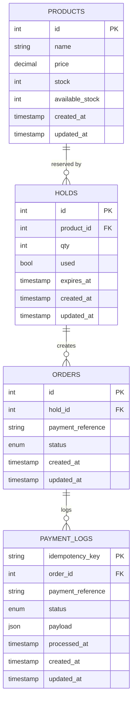

# GetPayIn Laravel API

A fully working **Payment & Hold Management REST API** built with Laravel.  
The project supports:
- Redis caching for product stock
- Hold system for reserving products before payment
- Payment Webhooks handling with idempotency

---

## Requirements

- PHP 8.2+
- Composer
- MySQL
- Redis
- Laravel CLI
- Postman (for testing APIs)

---

## Installation & Setup

1. **Clone the repository**
```bash
git clone https://github.com/Abdelrahman435/GetPayIn.git
cd GetPayIn
```

2. **Install dependencies**
```bash
composer install
```

3. **Copy & configure `.env`**
```bash
cp .env.example .env
```

Edit `.env` (example values):
```
DB_DATABASE=your_db
DB_USERNAME=root
DB_PASSWORD=

CACHE_DRIVER=redis
REDIS_HOST=127.0.0.1
REDIS_PORT=6379

FILESYSTEM_DRIVER=public
```

4. **Generate app key**
```bash
php artisan key:generate
```

5. **Run migrations**
```bash
php artisan migrate
```

6. **(Optional) Seed database**
```bash
php artisan db:seed
```

7. **Storage link for product images**
```bash
php artisan storage:link
```

8. **Clear caches (recommended)**
```bash
php artisan config:clear
php artisan cache:clear
php artisan route:clear
php artisan view:clear
```

9. **Start server**
```bash
php artisan serve
```
Default: `http://localhost:8000`

---

## API Overview

### Products & Stock
- `GET /api/products/{id}` → Get single product
- `POST /api/products` → Create product


### Holds
- `POST /api/holds` → Create a hold for a product Holds automatically expire after TTL or can be released manually.

### Orders & Payments
- `POST /api/orders` → Create order from a hold
- `POST /api/payments/webhook` → Payment webhook endpoint Payment webhooks are idempotent and safe to receive before or after order creation.


---

## Caching

- Redis is used to cache product available_stock.
- Cache key: product:{id}:available_stock 
- Cache is cleared automatically on stock update or hold release

`.env` sample for Redis:
```env
CACHE_DRIVER=redis
REDIS_HOST=127.0.0.1
REDIS_PORT=6379
```

---

## ERD (Entity Relationship Diagram)



## Notes & Assumptions

- Holds reduce `available_stock` and automatically release on expiration or failed payment.
- Payment webhooks are idempotent and can arrive before or after order creation.
- Stock caching uses Redis for fast reads.
- Redis is optional but recommended for caching.

- Use `PaymentWebhookService::processPendingFor($order)` to handle any pending webhooks after creating an order.

---

## License

MIT
